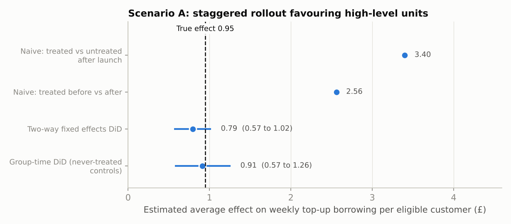
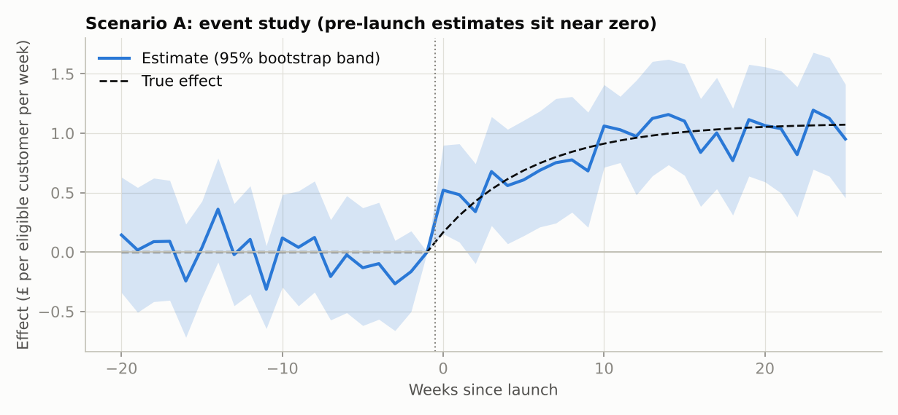
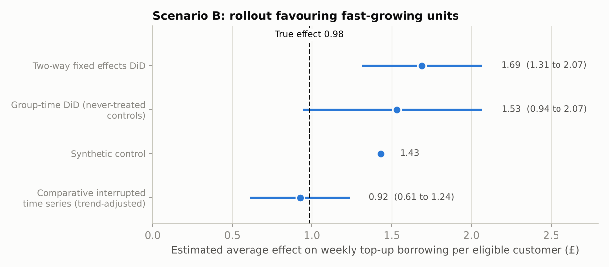
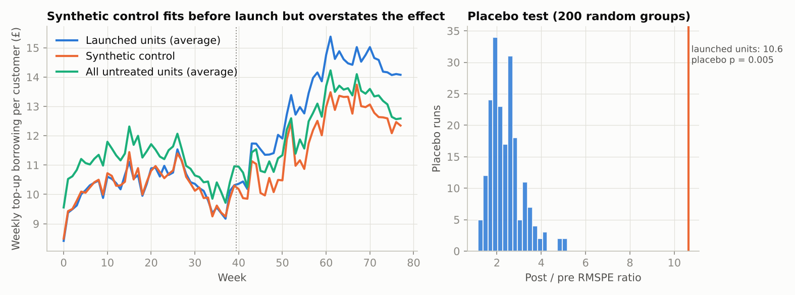
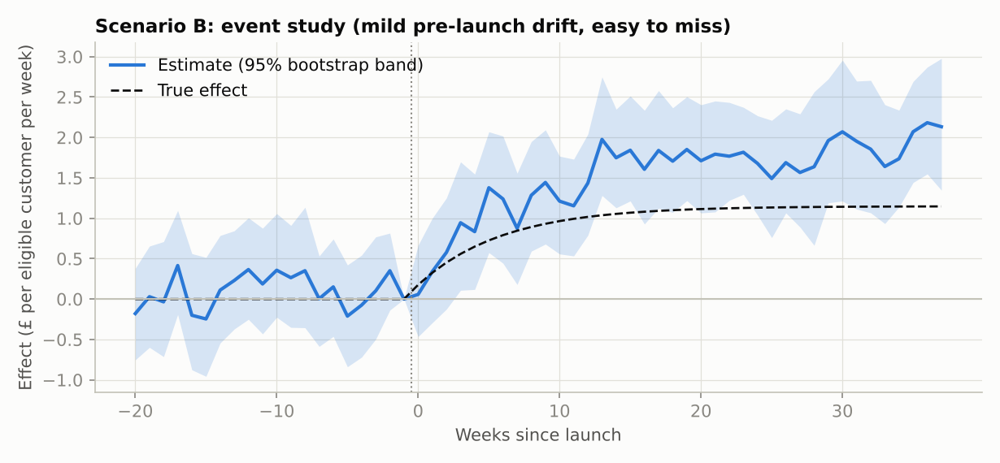

# Measuring a top-up notification without an A/B test: difference-in-differences, synthetic control and interrupted time series

Suppose a lender starts telling eligible customers "you can borrow more" and wants to know whether it **increases the value of each customer**. If the launch is not randomised (a partner switches it on for some customer groups, at different times), a plain comparison gives the wrong answer. This repo builds that situation from scratch and tests which causal methods recover the truth, when they fail, and what to reach for instead.

> **Synthetic data, stated up front.** Real data is private, so this uses a simulated panel of 60 partner-segments over 78 weeks with a **known true effect**. Because the truth is known, every estimator is scored on bias, RMSE and confidence-interval coverage over 200 simulated datasets, instead of looking convincing on one dataset. The outcome is a stand-in (weekly top-up borrowing per eligible customer, about £10 at baseline). Real customer lifetime value needs a longer window and careful handling of censoring. Effect sizes and selection rules are my assumptions.

## The two scenarios

| | Who got the notification | What breaks |
|---|---|---|
| **A: selection on levels** | Two launch waves (week 40 and 52) plus never-treated units. Rollout favoured units with high baseline borrowing. The effect builds over about 6 weeks and differs by wave. | Naive comparisons. Parallel trends still hold. |
| **B: selection on trends** | One wave at week 40, favouring units that were already growing faster. | Parallel trends **fail**, so standard DiD is biased. |

A third check, **B0**, uses scenario B's setup but launches regardless of trend, to confirm the code gives sensible answers when the assumptions hold.

## Methods (all written in numpy/scipy, `src/estimators.py`)

- **Naive baselines**: treated vs untreated after launch, and treated before vs after.
- **Two-way fixed-effects DiD** with cluster-robust standard errors.
- **Group-time DiD (Callaway–Sant'Anna style)**: compares each launch wave with never-treated units, aggregates to an event study and an overall effect, with a unit-level bootstrap. It also reports a pre-trend slope test.
- **Synthetic control**: convex-weight counterfactual (constrained least squares) with placebo-in-space inference.
- **Comparative interrupted time series (CITS)**: extrapolates the pre-launch trend in the treated-minus-untreated gap, with a bootstrap interval.

## Results

### Scenario A: naive comparisons fail, DiD works



One dataset (true effect £0.95 per customer per week): treated-vs-untreated gives **£3.40** and before-vs-after gives **£2.56**. The first picks up that treated units were already higher; the second picks up seasonality and drift. Both DiD methods land close to the truth (£0.79 and £0.91, intervals covering £0.95).

Over 200 datasets:

| Estimator | Bias (£) | RMSE (£) | 95% CI coverage |
|---|---|---|---|
| Naive: treated vs untreated | +2.52 | 2.56 | n/a |
| Naive: before vs after | +1.89 | 1.89 | n/a |
| Two-way fixed effects | −0.09 | 0.16 | 94% |
| Group-time DiD | +0.00 | 0.20 | 92% |

Two-way fixed effects did **fine** here. The well-known problem with staggered rollouts needs stronger differences between waves than I simulated, so I would not claim it is broken in this setup. The group-time estimator is still the safer default.



### Scenario B: when parallel trends fail



One dataset (true effect £0.98): two-way fixed effects says **£1.69**, with a confidence interval that excludes the truth. Group-time DiD (£1.53) and synthetic control (£1.43) are also too high. Only the trend-adjusted comparison (CITS) lands near the truth (£0.92, interval 0.61 to 1.24).

Over 200 datasets:

| Estimator | Bias (£) | RMSE (£) | 95% CI coverage |
|---|---|---|---|
| Two-way fixed effects | +0.96 | 0.98 | **0.5%** |
| Group-time DiD | +0.51 | 0.57 | 47.5% |
| Synthetic control | +0.63 | 0.66 | n/a |
| Comparative ITS (trend-adjusted) | +0.02 | 0.24 | 90.5% |

**Why synthetic control fails here.** The launched units were chosen for fast growth, so no weighted mix of the remaining units can reproduce their trend. It fits the pre-launch weeks closely (pre-launch RMSPE £0.14) and the placebo test is "significant" (p = 0.005, the smallest value 200 placebos allow), yet across the 200 datasets it overstates the effect by about 60% on average. **Passing a placebo test does not make the size of the effect right.** A good pre-launch fit is necessary, not sufficient.



**The pre-trend diagnostic is weak.** The event study shows mild pre-launch drift, but the pre-trend slope test rejected in only **33%** of datasets (and not in the example dataset). Passing a pre-trend test is weak reassurance, so the design argument (why were these units chosen?) matters as much as the test.



### Control check (B0): launch unrelated to trend

| Estimator | Bias (£) | RMSE (£) | 95% CI coverage |
|---|---|---|---|
| Two-way fixed effects | −0.01 | 0.22 | 95.5% |
| Group-time DiD | +0.01 | 0.26 | 95% |
| Synthetic control | +0.02 | 0.21 | n/a |
| Comparative ITS | +0.02 | 0.23 | 91% |

Every estimator is unbiased when the assumptions hold, which shows the code is working and that the failures above come from the data design.

## What I take from this

1. If you can randomise, randomise. These methods are for launches you did not control.
2. How units were selected into treatment decides which method is safe. Check it before choosing an estimator.
3. Naive comparisons were off by roughly three times. DiD was close in A and badly off in B. Test every method against a scenario where you know the answer.
4. The trend-adjusted comparison worked in B **by construction**: the simulated violation is a linear trend and the method extrapolates a linear trend. In real data that is an assumption to defend, not a guarantee.
5. Placebo and pre-trend tests have low power. Do not treat a pass as proof.

## Limitations

- Simulated data: unit effects, noise and selection are my assumptions, and no real customer behaviour is modelled.
- The outcome is a weekly proxy. Real CLtV needs survival-style handling of customers still active at the end of the window.
- Units are partner-segments analysed in aggregate. Customer-level covariates, spillovers and effects that vary by customer are not modelled.
- CITS assumes the pre-launch trend would have continued linearly; real trends curve.
- Synthetic control here has no intercept or outcome-model adjustment. Augmented or synthetic DiD variants would be sensible next steps.
- Built with AI assistance (Claude). The estimators are checked against closed-form answers in `tests/`, and all figures above come from `run_all.py`.

## Run it

```bash
pip install -r requirements.txt
python run_all.py          # about 30 seconds; regenerates figures/ and results/results.json
python tests/test_core.py  # 6 checks against known answers
```

Developed with Python 3.11.15, numpy 2.2.6, scipy 1.13.1 and matplotlib 3.10.9.

## Layout

```
src/simulate.py     panel simulator with known truth (scenarios A and B)
src/estimators.py   naive baselines, TWFE, group-time DiD, synthetic control, placebo, CITS
src/style.py        plot style
run_all.py          single datasets, 200-dataset Monte Carlo, figures, results.json
tests/test_core.py  checks against known answers
results/            JSON summary and run log
figures/            charts used above
```

A companion repo, [`partner-funnel-analysis`](https://github.com/Max-Isse/partner-funnel-analysis), covers funnel diagnosis, Bayesian partner-level estimation and sequential experiment design.
